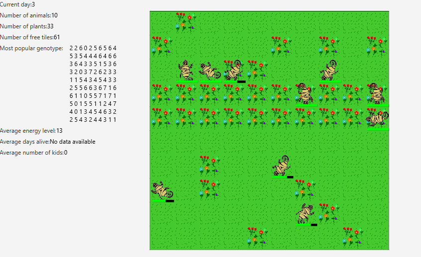
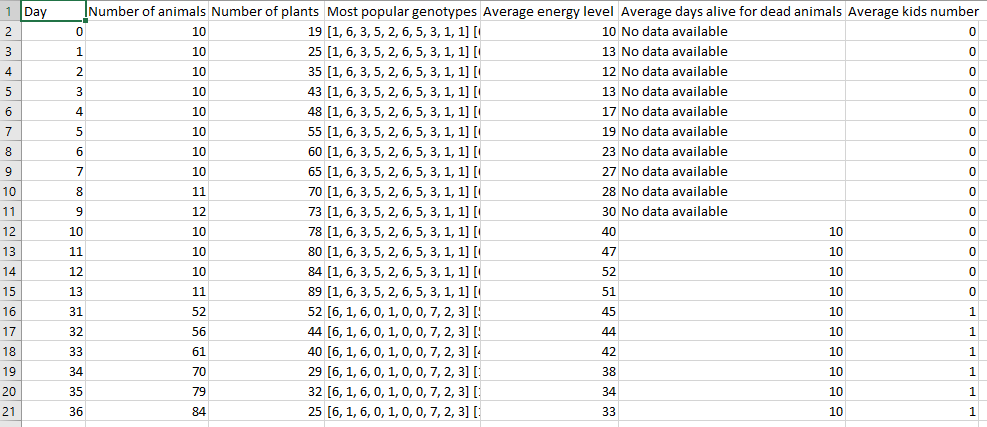
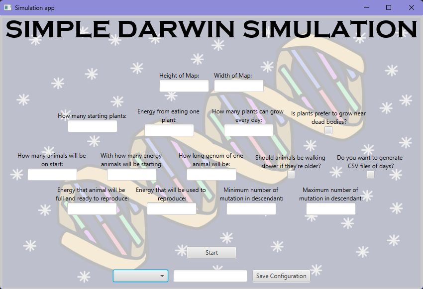
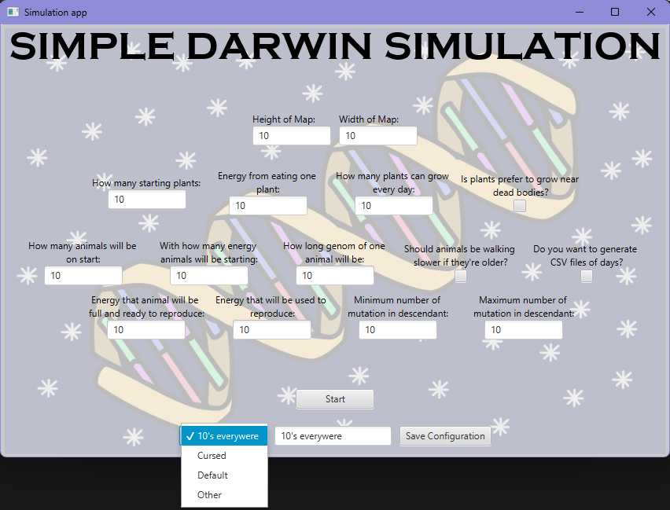
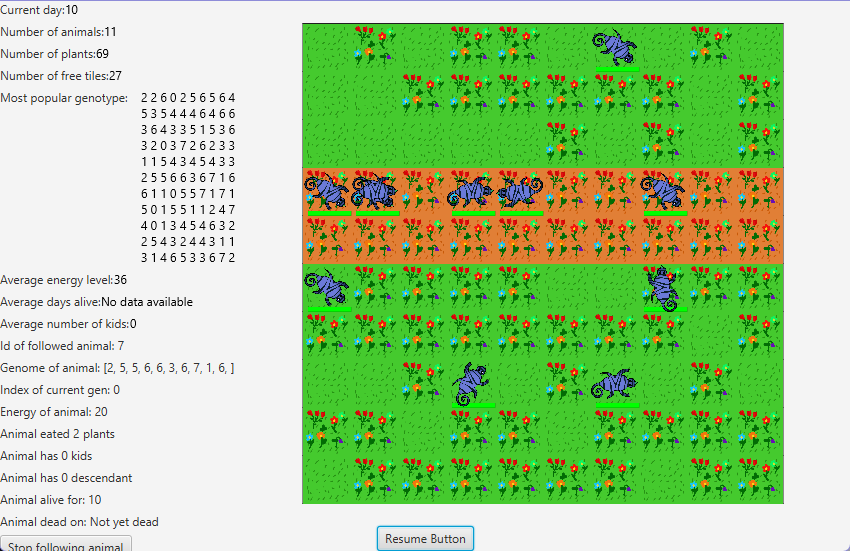

# ✨ Darwin World Simulation ✨

**Darwin World Simulation** is a project that we did for a **Object Oriented Programming** subject at our University. 
It has to simulate how animals would: 
* 🍀 Live 
* 🚶‍♂️‍➡️Move 
* 💌 Procreate 
* 🥦 Eat

Based on external factors such as their genome for example . 
**BUT** everyone had a slightly different task because we had to implement randomized extensions, and we got:
* 🧓 If an animal got **older** it was possible for it to **NOT MOVE**
* 💀 **Plants** prefered to grow near **dead bodies**

What is also in our project?
* 💬 **Logging** everything that has happened
* 📁 It is available to **save the project's statistics into a CSV file**
## Excel sheet

* 💾 **Saving** the map's configuration for future use
* 🏃 **Running**  multiple simulations at the same time

## Current settings menu

## Configurations

* ⏸️ **Pausing** the programme
* 🔍 **Tracking** an animal

